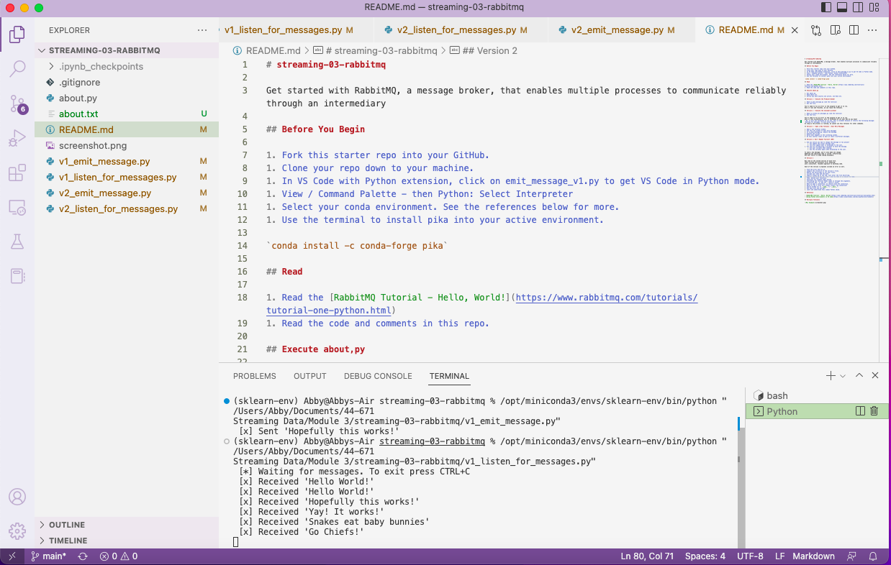
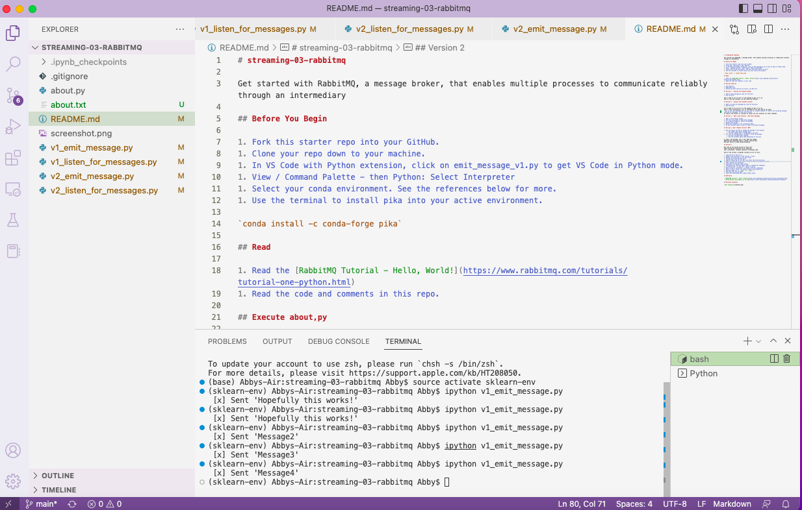

# Abby Lloyd, January 28, 2023

# streaming-03-rabbitmq

Get started with RabbitMQ, a message broker, that enables multiple processes to communicate reliably through an intermediary

## Before You Begin

1. Fork this starter repo into your GitHub.
1. Clone your repo down to your machine.
1. In VS Code with Python extension, click on emit_message_v1.py to get VS Code in Python mode.
1. View / Command Palette - then Python: Select Interpreter
1. Select your conda environment. See the references below for more.
1. Use the terminal to install pika into your active environment. 

`conda install -c conda-forge pika`

## Read

1. Read the [RabbitMQ Tutorial - Hello, World!](https://www.rabbitmq.com/tutorials/tutorial-one-python.html)
1. Read the code and comments in this repo.

## Execute about,py

1. Run about.py.
1. Read about.txt. 
1. Verfiy you have exactly one active, one None env.

## Version 1 - Execute the Producer/Sender

1. Read v1_emit_message.py (and the tutorial)
1. Run the file. 

You'll need to fix an error in the program to get it to run.
Once it runs and finishes, we can reuse the terminal.

## Version 1 - Execute the Consumer/Listener

1. Read v1_listen_for_messages.py (and the tutorial)
1. Run the file.

You'll need to fix an error in the program to get it to run.
Once it runs successfully, will it terminate on its own? How do you know? 
- No, it will not terminate on its own. This is evident because it returns the following message: 'Waiting for messages. To exit press CTRL+C
- As long as the process is running, we cannot use this terminal for other commands. 

## Version 1 - Open a New Terminal / Emit More Messages

1. Open a new terminal window.
1. Use this new window to emit more messages
1. In v1_emit_message.py, modify the message. 
1. Execute the script. 
1. Watch what happens in the listening window.
1. Do this several times to emit at least 3 different messages.

## Version 1: Don't Repeat Yourself (DRY)

1. Did you notice you had to change the message in two places?
    1. You update the actual message sent. 
    1. You also update what is displayed to the user. 
1. Fix this by introducting a variable to hold the message. 
    1. Use your variable when sending. 
    1. Use the variable again when displaying to the user. 

To send a new message, you'll only make one change.
Updating and improving code is called 'refactoring'. 
Use your skills to keep coding enjoyable. 

## Version 2

Now look at the second version of each file.
These include more graceful error handling,
and a consistent, reusable approach to building code.

Each of the version 2 programs include an error as well. 

1. Find the error and fix it. 
1. Compare the structure of the version 2 files. 
1. Modify the docstrings on all your files.
1. Include your name and the date.
1. Imports always go at the top, just after the file docstring.
1. Imports should be one per line - why? 
- So that it is easier to read and interpret.
1. Then, define your functions.
1. Functions are reuable logic blocks.
1. Everything the function needs comes in through the arguments.
1. A function may - or may not - return a value. 
1. When we open a connection, we should close the connection. 
1. Which of the 4 files will always close() the connection?
- Both of the files that listen for messages need to be closed using Ctrl + C. The files that send messages close automatically.
1. Search GitHub for if __name__ == "__main__": 
1. How many hits did you get? 40,004,770
1. Learn and understand this common Python idiom.

## Reference

- [RabbitMQ Tutorial - Hello, World!](https://www.rabbitmq.com/tutorials/tutorial-one-python.html)
- [Using Python environments in VS Code](https://code.visualstudio.com/docs/python/environments)

## Multiple Terminals
- I toggled between terminals in VS Code. The screenshots of the terminals are below. The first was titled "Python" and the second was titled "bash" on the right side of the screen.

